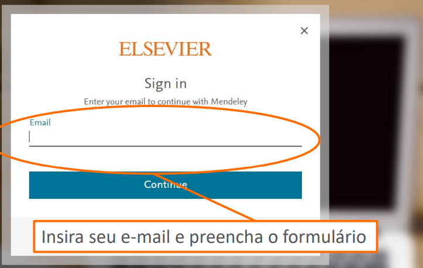
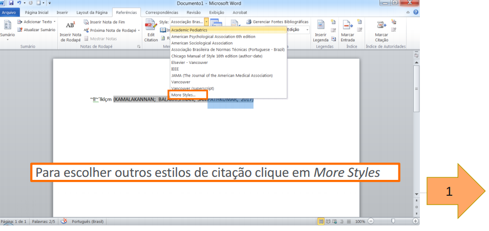
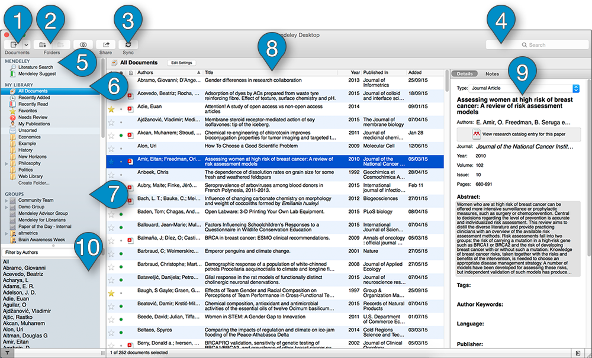

layout: true
  

Programa de Pós-graduação em Ciências da Reabilitação e Desempenho Físico-Funcional - UFJF

---
class: middle

# Tópicos da aula

- O que é Mendeley?

- Como acessar o Mendeley?

- Instale o Mendeley Desktop

- Comece a alimentar sua biblioteca pessoal

- Inserir citações – Instalação do Plugin do MS Word – Mendeley Desktop

- Inserir citação – no Word

- Escolha o Estilo Bibliográfico – no Word

- Inserir referências – no Word

- Interface do Mendley Desktop

- Comparações entre gerenciadores

---
class: left
# O que é Mendeley?

Mendeley é um gerenciador de referências que lhe permite gerir, ler, compartilhar, anotar e citar seus trabalhos de pesquisa.

... e uma rede de colaboração acadêmica com 6 milhões de usuários para se conectar com
pesquisadores e descobrir tendências de pesquisa.

… formando uma base de dados colaborativa (crowdsourced database – alimentada pelos próprios usuários).

---
class: left
# O que é Mendeley ?

- Sincronize através da web, desktop e dispositivos móveis.

- Extrai automaticamente metadados de PDFs.

- Suporta 7.500 estilos de citação e é fácil editá-los.

---
class: left
# O que é Mendeley?

## Mendeley Datasets

Os dados de pesquisas como tabelas, gráficos, imagens e documentos podem ser armazenados
no Mendeley DATASETS, possibilitando, além da disseminação de forma aberta dos dados, a
possibilidade de uma maior visibilidade da pesquisa desenvolvida.

---
class: left
# O que é Mendeley?

## Mendeley Careers

O Mendeley tem um espaço especial para carreiras. São milhares de vagas disponibilizadas na plataforma, você pode criar alertas de vagas de trabalho, disponibilizar seu Currículo, oferecer oportunidades de trabalho e baseado em seu perfil, receber sugestões de vagas.

---
class: left
# Como acessar o Mendeley?

Acesse: https://www.mendeley.com/

---
class: left
# Como acessar o Mendeley?

- Crie sua conta no Mendeley

---
class: left
# Instale o Mendeley Desktop

---
class: left
# Instale o Mendeley Desktop

 [Mendeley Desktop](https://www.mendeley.com/download-reference-manager/windows) download.

---
class: left
# Comece a alimentar sua biblioteca pessoal

*Atenção*: observe os metadados do pdf importado.

*Atenção*: importe pelo doi.

---
class: left
# Inserir citações – Instalação do Plugin do MS Word – Mendeley Desktop

---
class: left
# Inserir citação – no Word

- Abra um novo documento e clique na aba “Referências”
- No momento de inserir a citação, clique no botão “Insert Citation” e busque 
diretamente na sua biblioteca do Mendeley

---
class: left
# Escolha o Estilo Bibliográfico – no Word

---
class: left
# Escolha o Estilo Bibliográfico – no Word

---
class: left
# Escolha o Estilo Bibliográfico – no Word

---
class: left
# Escolha o Estilo Bibliográfico – no Word

---
class: left
# Escolha o Estilo Bibliográfico – no Word

---
class: left
# Escolha o Estilo Bibliográfico – no Word

---
class: left
# Inserir referências – no Word

---
class: left
# Inserir citações – alternativa

1. Abra o Word

2. Vá em Inserir - Obter Suplementos - Procure por Mendeley Cite

3. Adicione o Plugin

---
class: left
# Inserir citações – alternativa

<video width="640" height="480" controls>
  <source src="videos/Inserindo_citacao.mp4" type="video/mp4">
  Seu navegador não suporta o elemento de vídeo.
</video>

---
class: left
# Inserir referências – alternativa

<video width="640" height="480" controls>
  <source src="videos/Inserindo_referencias.mp4" type="video/mp4">
  Seu navegador não suporta o elemento de vídeo.
</video>

---
class: left
# Escolher o Estilo Bibliográfico – alternativa

<video width="640" height="480" controls>
  <source src="videos/mundar_estilo.mp4" type="video/mp4">
  Seu navegador não suporta o elemento de vídeo.
</video>
---
# Interface do Mendley Desktop

---
class: left
# Comparações

---
class: left
# Comparações

---
class: left
# Comparações

---
class: center, middle

# Obrigado pela paciência!

*edf.tercio@gmail.com*

---
# Créditos

[Mendeley Organize e otimize a sua pesquisa](https://www.periodicos.capes.gov.br/images/documents/MENDELEY_AUG_2018_PORT.pdf)

www.elsevier.com/solutions/mendeley

https://www.mendeley.com/guides

